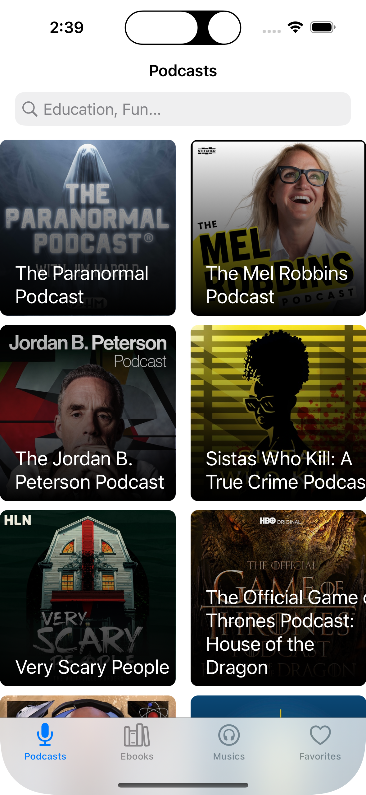
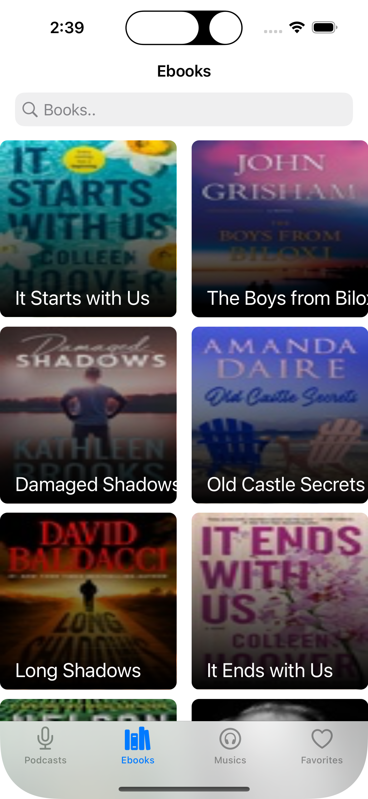
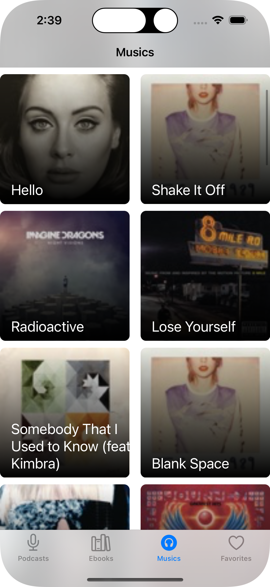
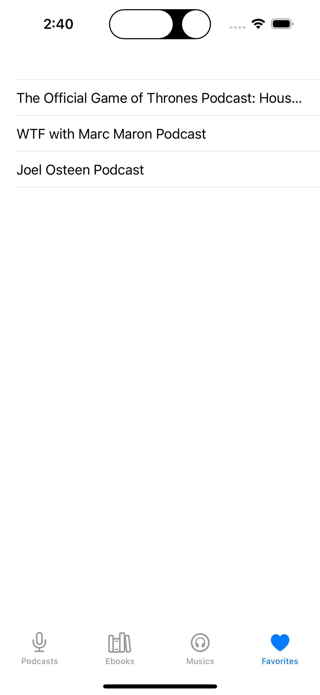
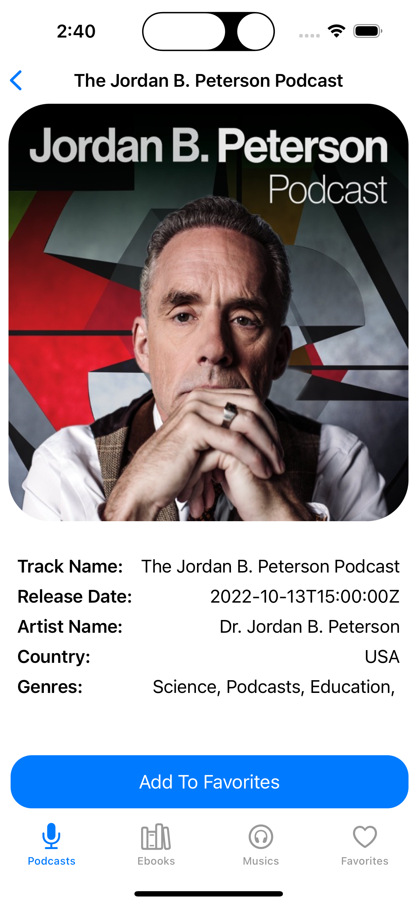

 
  

<h1 align="center"> 🎶 iTunes Search App 🎶 </h1>

<h2>
  About :grey_question:
</h2>

  This is an app that fetches iTunes API data and displays it to user to see the product details. The user can add products and remove them from favorites.

<h2>
  Flow :ocean:
</h2>

  When you start the app it welcomes you with fetched podcasts, ebooks, musics from the API. The user can go into their detail page by clicking on then. There are 4 tabs in the app called "Podcasts, Ebooks, Musics, Favorites". In product detail screen user can click on the add favorites button and add that product to favorites. In favorites tab user can delete products from favorites by swiping.

<h2>Features 📱</h2>
<ul>
  <li>Programmatic UI</li>
  <li>Core Data</li>
  <li>Adding and deleting from Favorites</li>
</ul>
<h2>
  Screenshots :camera_flash:
</h2>
<h3>API Tabs</h3>

    
    
    

<h3>Favorite & Detail Tabs</h3>

    
    

<h1> Installation </h1>

### How to run the example?

1. Clone this repo
1. Open shell window and navigate to project folder
1. Run `pod install`
1. Open `iTunes Client App.xcodeproj` and run the project on selected device or simulator

